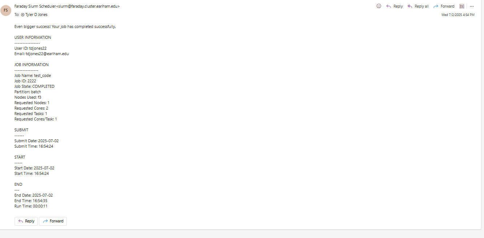

# Slurm-Mail
This is a script that I wrote in Bash to send people emails when their Slurm job starts, ends, and/or fails. This was my first attempt at creating something responsible for sending automated emails queried by a separate process (Slurm). It's very bare-bones, containing very little information that is formatted strangely. v2 with HTML is a major improvement. Also, why did I write this in Bash? Needlessly complicated. 

## Example Email

